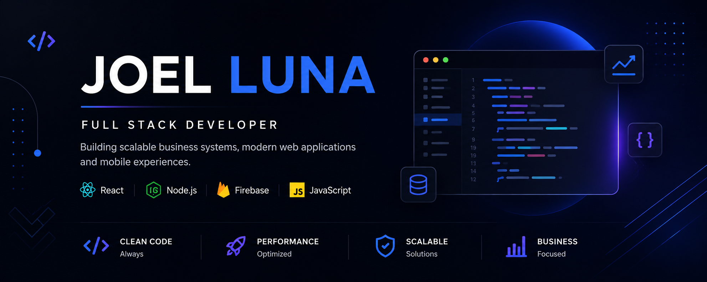

  

# Joel Luna

## Full Stack Developer

Building scalable business systems, modern web applications and mobile experiences.

---

## 📊 GitHub Stats

  
  
  

## 🚀 Technologies

- React
- Node.js
- Firebase
- JavaScript
- MySQL

---
## 🚀 Featured Projects

### Production Downtime Dashboard
Production downtime tracking dashboard for manufacturing environments.

### Employee Learning System
Web platform for employee training and onboarding management.

## 💼 Featured Projects

### Production Downtime Dashboard
Production downtime tracking dashboard for manufacturing environments.

### Employee Learning System
Web platform for employee training and onboarding management.

---

## 📫 Contact

- Email: 
